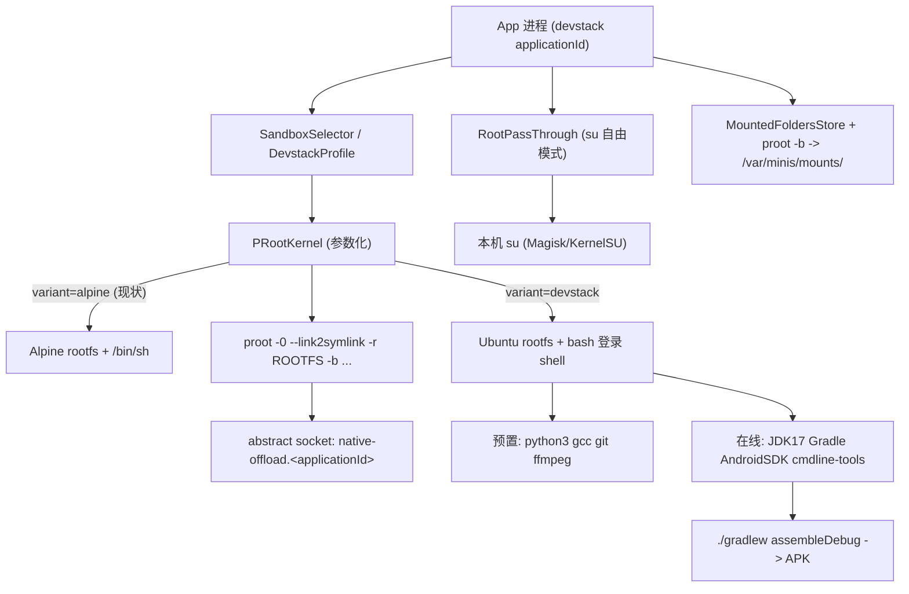

# Android GLibc Devstack — 技术设计

Feature Name: android-glibc-devstack
Updated: 2026-09-15
依据: `requirements.md`（决策：Ubuntu 24.04 / root 自由模式 / 混合交付）

## Description

在 OpenMinis Android 端现有 proot + Alpine 沙箱架构上增加第二套沙箱形态 "Devstack Rootfs"（Ubuntu 24.04 aarch64, GLibc + apt），并完成四项增强：手机端 Android 编译工具链、Agent root 直通（经本机 `su`）、SAF 挂载在 devstack 下生效、与原版 OpenMinis 共存隔离。

设计原则：**复用现有沙箱骨架，最小侵入**。`PRootKernel` 已将 rootfs 路径、proot argv 构建、bind mounts、native-offload 注入全部参数化，第二套 rootfs 主要在配置层扩展，proot 二进制与 ELF loader 复用同一套。

## Architecture



### 关键架构决策

**D1 — 第二套 rootfs 的接入方式：SandboxProfile 抽象**

现有代码中 rootfs 路径写死为 `File(context.filesDir, "alpine-rootfs")`（`RootfsManager.kt:42`）。引入：

```kotlin
data class SandboxProfile(
    val variant: String,            // "alpine" | "devstack"
    val rootfsDir: File,            // filesDir/alpine-rootfs | filesDir/devstack-rootfs
    val defaultShell: String,       // /bin/sh | /bin/bash -l
    val loginShellArgv: List<String>,
    val rootfsAssetName: String,    // alpine-minirootfs.tar.gz | devstack-rootfs.tar.gz
    val aptRepoMirror: String?,     // devstack 专用
    val extraEnv: Map<String, String>,
)
```

`RootfsManager` / `PRootKernel` / `PersistentShell` / `ShellExecutor` / `TerminalSession` 全部改为从 profile 取值。原版 Alpine 路径保持不变，零回归风险。

**D2 — Devstack rootfs 产线：`scripts/prepare_devstack_rootfs.sh`**

新脚本产出 `devstack-rootfs.tar.gz`（放 `assets/`，仿照 `alpine-minirootfs.tar.gz` 的 noCompress 处理）：

1. 下载 `ubuntu-base-24.04-arm64` 官方 base 镜像（约 30MB）
2. 在 CI Linux 容器内通过 proot + qemu-user-static 做**离线预配置**：
   - `apt-get install` 预置组件：`python3 python3-pip python3-venv gcc g++ make git ffmpeg curl wget unzip tar xz-utils file less procps bash-completion`（混合交付的"预置"部分）
   - 写入 `/etc/profile.d/devstack.sh`（PS1、HISTFILE、JAVA_HOME/ANDROID_HOME 占位、PATH）
   - `/etc/apt/sources.list` 指向可配置镜像（默认官方，构建参数可切 mirrors.tuna 等国内源）
   - 预创建 `/var/minis/{attachments,offloads,workspace,skills,memory,shared,mounts}` 与 `/opt/bin`（对齐原版目录约定，`RootfsManager.kt:131-138`）
   - 复制原版 URL 拦截 wrapper（`minis-open` 等）与 minis-mcp-cli 到 `/usr/local/`（从 `assets/default_mount/` 复用）
   - 写 `.arch` = `aarch64` 标记
3. `tar czf` 打包（preserve xattrs；禁用 hardlink 以规避 `--link2symlink` 边界情况）

APK 体积增量估算：预置组件后 rootfs 约 250–400MB（tar.gz），可接受。

**D3 — 共存隔离：applicationId + abstract socket 名限定**

- 新 applicationId：`app.openminis.devstack`（`build.gradle.kts` 的 `applicationId`/`namespace`）
- **abstract socket 命名冲突修复**（Req 5.2/5.4，唯一冲突源 `"native-offload"`）：
  - Kotlin 侧：`NativeOffload.kt:55` 的 `SOCKET_NAME` 改为运行时从 `BuildConfig.APPLICATION_ID` 拼接：`"native-offload." + BuildConfig.APPLICATION_ID`
  - C 侧（proot fork）：`native_offload.h:17` 的 `NATIVE_OFFLOAD_DEFAULT_SOCKET` 改为编译期注入：`build_proot.sh` 增加参数 `-DNATIVE_OFFLOAD_DEFAULT_SOCKET="\"native-offload.app.openminis.devstack\""`（宏默认值保留向后兼容）
  - argv 注入点（`PRootKernel.kt:651`、`PersistentShell.kt:208`、`TerminalSession.kt:421`）统一改为从 `NativeOffloadServer.socketName` 取值——该常量已是运行时属性，三处硬编码改为引用同一来源
- 端口冲突（Req 5.5）：debug server（5321）、OAuth 回调端口改为 devstack 构建变体的 `BuildConfig` 字段，偏移 +1000（如 6321）；OAuth 端口因 redirect URI 绑定无法改（Non-Goals 已声明）
- 数据隔离：applicationId 不同 → Android 系统天然隔离 filesDir/cacheDir，rootfs 目录名再区分为 `devstack-rootfs`，双保险

**D4 — root 直通：RootPassThrough 工具（自由模式）**

新 offload 处理器 + 沙箱 CLI 双入口：

- **入口 A（推荐路径）**：新 native offload handler `android-root-cli`（注册进 `MinisApp.kt` handler 列表），guest 内通过 stub `/usr/local/bin/android-root-cli` 触发 execve 拦截
- **入口 B**：沙箱内 `/usr/local/bin/sudo-root` wrapper，直接对宿主 `su` 做 execve offload 转发

实现（`sandbox/offload/RootPassThroughHandler.kt`）：
1. 读取权限开关 `RootPassThroughSettings`（`DataStore`，默认关闭；开启即自由模式）
2. `Runtime.exec("su")` 起 root shell，写命令、收 stdout/stderr/exit code（超时 120s 可配）
3. 审计日志：append 到 `filesDir/audit/root-<date>.log`（时间戳、完整命令、退出码、输出摘要前 2KB）
4. `su` 不存在/授权拒绝 → 结构化错误 envelope（与 `ShizukuOffloadHandler.kt:72-81` 风格一致），Agent 侧表现为工具报错

安全边界（自由模式的风险声明，写入设置页文案）：
- 开关开启后 Agent 可执行任意 root 命令（含删改系统文件），风险自担
- 开关状态变更记录审计日志
- root 直通与 Shizuku 通道并存，互不影响

**D5 — 手机编译 APK：工具链在线安装器**

`DevstackToolchainInstaller`（Kotlin，沙箱内执行）：

| 组件 | 来源 | 安装路径 | 环境变量 |
|------|------|----------|----------|
| JDK 17 | Temurin aarch64 tar.gz | `/opt/jdk17` | `JAVA_HOME` |
| Gradle | gradle-8.x-bin.tar.gz | `/opt/gradle` | `GRADLE_HOME` |
| Android cmdline-tools | 官方 zip | `/opt/android-sdk/cmdline-tools/latest` | `ANDROID_HOME`, `ANDROID_SDK_ROOT` |
| platform + build-tools | sdkmanager 安装 | `/opt/android-sdk/{platforms,build-tools}` | `PATH` 追加 |
| NDK（可选） | sdkmanager | `/opt/android-sdk/ndk/<ver>` | `NDK_HOME` |

- aapt2 兼容性（Req 2.4）：Android 官方 build-tools 内 aapt2 是 x86_64 ELF。方案：`sdkmanager` 装完后自动下载 **aapt2 aarch64 linux 构建**（Android Gradle Plugin 官方 maven: `com.android.tools.build:aapt2:<ver>-<build>-linux` 有 aarch64 发布物；或在 `gradle.properties` 写 `android.aapt2FromMavenOverride=/opt/aapt2/aapt2-aarch64`）——这是社区（Termux/Ubuntu proot 手机编译）已验证的标准做法。d8/R8 是 Java 实现，aarch64 JVM 下原生可用。
- 安装进度：组件级状态机（`NOT_INSTALLED → DOWNLOADING → EXTRACTING → READY`）+ 设置页 UI（复用 `MountedFoldersScreen` 的卡片风格）
- 断点续传：下载用 `.part` 临时文件 + sha256 校验
- `gradle.properties` 预写 `org.gradle.jvmargs=-Xmx2g`、aapt2 override、离线缓存路径

**D6 — SAF 挂载在 devstack 生效**

现有机制（treeUri → POSIX path → proot `-b` bind）与 rootfs 无关，天然可复用。仅需：
- `PRootKernel.applyMountedFoldersSnapshot()` 等逻辑迁入 profile 参数化路径
- devstack 下挂载点占位目录 `/var/minis/mounts/` 已在 D2 步骤 2 预创建
- 只读写守卫 wrapper（`PRootKernel.kt:848-922`）对 bash/glibc 环境同样有效（wrapper 是 `/usr/local/bin` 下的 shim，PATH 优先级覆盖真实命令）

## Components and Interfaces

| 组件 | 位置 | 职责 |
|------|------|------|
| `SandboxProfile` | `sandbox/SandboxProfile.kt` (新) | rootfs 变体配置数据类 + `resolve(context, variant)` |
| `RootfsManager` (改) | `sandbox/RootfsManager.kt` | 接受 profile 参数；devstack 走 `devstack-rootfs.tar.gz` 资产 |
| `PRootKernel` (改) | `sandbox/PRootKernel.kt` | boot/buildProotCommand 全部参数化；socket 名引自 `NativeOffloadServer.socketName` |
| `NativeOffload` (改) | `sandbox/NativeOffload.kt` | `SOCKET_NAME` = `"native-offload." + BuildConfig.APPLICATION_ID` |
| `deps/proot` (改) | `native_offload.h` | 默认 socket 名宏编译期可注入 |
| `deps/build_proot.sh` (改) | 构建脚本 | 新增 `-D` socket 名注入参数 |
| `RootPassThroughHandler` | `sandbox/offload/RootPassThroughHandler.kt` (新) | `su` 执行、审计日志、错误 envelope |
| `RootPassThroughSettings` | `data/` (新) | DataStore 开关 |
| `DevstackToolchainInstaller` | `sandbox/toolchain/` (新) | JDK/Gradle/SDK 下载安装、进度状态机 |
| `ToolchainScreen` | `ui/settings/` (新) | 工具链安装 UI |
| `DevstackSettingsScreen` | `ui/settings/` (新) | root 直通开关 + 风险文案 + 审计日志查看 |
| `scripts/prepare_devstack_rootfs.sh` | `scripts/` (新) | Ubuntu rootfs 离线预配置与打包 |
| `ui/terminal/TerminalSession` (改) | devstack 变体下启动 `bash -l` |

## Data Models

```kotlin
// SandboxProfile
enum class SandboxVariant { ALPINE, DEVSTACK }

// RootPassThroughSettings (DataStore keys)
root_passthrough_enabled: Boolean = false

// ToolchainComponent
data class ToolchainComponent(
    val id: String,            // "jdk17" | "gradle" | "android-sdk" | "ndk"
    val state: ToolchainState, // NOT_INSTALLED/DOWNLOADING/EXTRACTING/READY/FAILED
    val installedVersion: String?,
    val downloadUrl: String,
    val sha256: String,
    val sizeBytes: Long,
)

// 审计日志条目 (JSON lines)
{ "ts": 1726370000, "cmd": "...", "exit": 0, "out_preview": "..." }
```

## Correctness Properties

1. applicationId 为 `com.openminis.app` 的原版与本版本同屏运行时，`ss -x | grep native-offload` 可见两个不同的 abstract socket 名
2. devstack 变体 rootfs 路径、数据目录、端口与 alpine 变体全集合不相交
3. root 直通开关关闭时，`android-root-cli` / `sudo-root` 一律返回结构化拒绝
4. 所有 root 调用在审计日志中有对应记录（开关开启期间）
5. 工具链安装完成后新 shell 中 `java -version && gradle -v && sdkmanager --version` 全部成功
6. 空的 Gradle Android 工程 `./gradlew assembleDebug` 在沙箱内产出 `app-debug.apk`
7. SAF 挂载目录在 devstack shell 内 `ls /var/minis/mounts/<name>` 可见且写入落盘到手机真实目录

## Error Handling

| 场景 | 处理 |
|------|------|
| rootfs 空间不足 | 安装前 `StatFs` 检查，错误提示含所需/可用空间 |
| rootfs 下载失败/断点 | `.part` 续传 + sha256 校验失败重试 |
| `su` 不存在 | 结构化 envelope `ROOT_UNAVAILABLE` + 设置页引导（Magisk/KernelSU） |
| `su` 授权拒绝 | envelope `ROOT_DENIED` |
| root 命令超时 | 120s 默认超时，kill 进程组，envelope `ROOT_TIMEOUT` |
| sdkmanager 网络失败 | 组件级重试，状态 FAILED 可手动重装 |
| aapt2 aarch64 不可用 | 构建错误信息指向 `android.aapt2FromMavenOverride` 配置说明 |
| abstract socket 被占（异常场景） | 保留现有 `bindWithRetry` 退避逻辑，socket 名已带包名后冲突概率归零 |

## Test Strategy

- **单元**：`SandboxProfile.resolve`；socket 名构造（含两 applicationId 断言不同）；`RootPassThroughHandler` 状态机与 envelope；审计日志 JSON 格式
- **集成（真机）**：
  - 双版本共存：原版 + devstack 同时安装、同时启动沙箱、各自 offload 正常
  - devstack shell：apt install、gcc 编译运行、python3、ffmpeg 转码
  - 工具链：全量安装后空工程 `assembleDebug` 产出 APK
  - root 直通：开关关闭拒绝、开启执行 `su -c id`、审计日志落盘
  - SAF 挂载：写入穿透与只读守卫
- **构建产物校验**：`build_proot.sh` 宏注入后 `strings libproot.so | grep native-offload.app` 断言；rootfs tar 大小下限校验（仿 `verify_artifacts`）

## References

[^1]: `src/android/app/src/main/java/com/openminis/app/sandbox/PRootKernel.kt` — proot argv 构建与 boot 流程
[^2]: `src/android/app/src/main/java/com/openminis/app/sandbox/NativeOffload.kt` — abstract socket 服务端
[^3]: `deps/proot/src/extension/native_offload/native_offload.c` — socket 连接 C 侧实现
[^4]: `scripts/prepare_android_sandbox.sh` — 现有 rootfs 产线参照
[^5]: `src/android/app/src/main/java/com/openminis/app/sandbox/offload/ShizukuOffloadHandler.kt` — offload handler 与错误 envelope 风格参照
[^6]: `src/android/app/src/main/java/com/openminis/app/data/MountedFoldersStore.kt` — SAF 挂载存储
[^7]: `src/android/app/build.gradle.kts` — applicationId 与 asset noCompress
