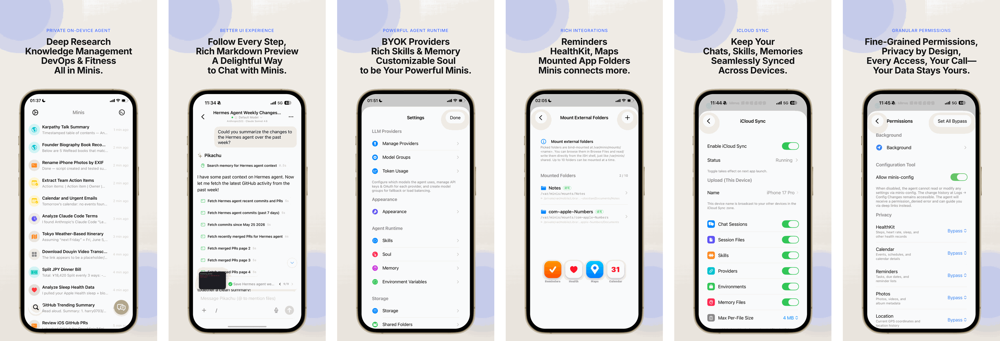

# Minis Ultra（OpenMinis-Linux）

[](LICENSE)
[](#下载)
[](https://github.com/tall-1997/OpenMinis-Linux/releases)

**端侧私人 AI Agent。** 把 Claude、GPT、Gemini 等模型接到手机里的一台真 Linux：Ubuntu 24.04 沙箱、浏览器自动化、技能与记忆、多智能体调度。

本仓库是 [OpenMinis](https://github.com/OpenMinis/OpenMinis) 的 **Linux 沙箱 Android 分支**。启动器名称 **Minis Ultra**，包名 `com.openminis.linux`，可与官方 OpenMinis **并排安装**。当前 **1.36.17-linux**（versionCode 70）。检查更新 / 关于页指向本 fork：[`tall-1997/OpenMinis-Linux`](https://github.com/tall-1997/OpenMinis-Linux)。

## 仓库介绍

- **沙箱即电脑**：客户机 Ubuntu 24.04（PRoot），可装包、跑脚本；主机 `su`、工具链 `minis-dev-setup`、POSIX `/sdcard` 挂载见 [LINUX.md](LINUX.md)。
- **项目工作区（1.36.14）**：一个项目文件夹里可以有多个会话，共享 `workspace` / 附件 / 浏览器缓存；日记仍按会话隔离。未分组会话保持 1.36.13 的一会话一工作区。技能 / 共享 / MCP 仍全局。
- **模型参数自动补全（1.36.1）**：先查 models.dev（去厂商前缀、统一大小写和 `./_` → `-`，再按精确 ID → 归一化 ID → 全库多数票），没有的洞用 DataLearner 补，中转站脏名（如 `GPT-6免费` / `免费GPT-6 Astra`）按命中最多的字匹配。目录和家族都认不出的 id 默认 **256k 上下文 / 128k 输出 / 开启思考（最高 max）/ 文本模态**。
- **多智能体**：主会话当协调者，设置 → 多智能体（`minis://settings/multi-agent`）。
- **签名与国内编译**：[docs/SIGNING.md](docs/SIGNING.md)、[docs/android-sdk-mirrors.md](docs/android-sdk-mirrors.md)（切勿覆盖 aarch64 aapt2）。
- **1.36.17**：已归档会话每次启动收敛到项目工作区；移出/解散分组会把共享文件拷回会话；会话列表只留一个「新建文件夹」FAB。
- **1.36.16**：Termux 终端、提供商置顶与并行刷新、dpkg/pip 世界快照、一级设置无返回箭头、选中文字分享、技能 requirements 与平台环境变量；并带上 1.36.15 的工作区归档与原子写文件。
- **1.36.14**：项目工作区、折叠条只显示过程摘要、旧日记迁入会话、multipart 直通。
- **1.36.13**：会话工作区隔离；内置人格重写并在本版安装时覆盖一次 SOUL.md；移除人格扩展。
- **1.36.11**：长会话人格不被历史盖过；AI 过程折叠改为完成后立刻收起且仍能点开工具详情；子代理运行中可看日志；人格页一级返回自动保存身份。
- **1.36.10**：人格提示词显示文件名、点进二级页编辑；可导入 .md/.txt 到私有目录并用下拉选择；不同供应商可绑不同提示词。
- **中文发行说明**：[docs/RELEASE-NOTES.zh.md](docs/RELEASE-NOTES.zh.md)。

## 下载

- **本版发行包（1.36.17-linux / versionCode 70）**：[Releases `1.36.17-linux`](https://github.com/tall-1997/OpenMinis-Linux/releases/tag/1.36.17-linux) → `minis-ultra-com.openminis.linux.apk`
- **滚动构建**：[Releases `android-latest`](https://github.com/tall-1997/OpenMinis-Linux/releases/tag/android-latest)（main 每次成功构建都会覆盖）

侧载前允许「安装未知应用」。可与官方 OpenMinis 并排安装。debug 签名无法覆盖不同证书的已装版本，见 [docs/SIGNING.md](docs/SIGNING.md)。

### 1.36.17 要点

已归入项目的会话每次启动都会把仍留在私有目录的共享文件搬进项目工作区（修 1.36.14 只写了 `folder_id`、没搬文件的半归档）。从分组移出或解散分组时，共享文件会拷回该会话私有目录；有冲突则保留项目副本，避免误删。会话列表右下角只留一个「新建文件夹」FAB，新对话从文件夹卡片或长按选模型组进入。完整说明：[docs/RELEASE-NOTES.zh.md](docs/RELEASE-NOTES.zh.md)。

### 1.36.16 要点

终端改用 Termux VT；提供商可置顶并一键并行刷新；沙箱启动先自愈 apt 镜像再重试 dpkg/pip 世界；重置 Linux 会先快照再还原用户包。一级设置页去掉返回箭头。系统「选择文字」可分享进会话。技能 `requirements.json` 按 Debian `apt` 解析，环境变量页显示平台集成。另含 1.36.15：遗留会话归档进工作区、工具写文件原子化。完整说明：[docs/RELEASE-NOTES.zh.md](docs/RELEASE-NOTES.zh.md)。

### 1.36.14 要点

会话可归入项目工作区：同一文件夹共享磁盘工作区，日记仍按会话。主页 FAB 改为「新建工作区会话」。折叠的 AI 过程条只显示标题和计数。旧版 `minis-global/memory` 日记会拷进各会话。模型直通支持 multipart。完整说明：[docs/RELEASE-NOTES.zh.md](docs/RELEASE-NOTES.zh.md)。

### 1.36.13 要点

每个会话是独立工作区：`/var/minis/{workspace,memory,attachments,offloads,browser}` 互不可见；技能 / 共享 / MCP 装在工作区外全局目录。删除会话会删除对应工作区全部文件（含记忆）。内置人格改为详细的 Minis Ultra；本版安装时强制覆盖一次 `SOUL.md`（不论用户是否改过）。设置里的「人格扩展」已移除。完整说明：[docs/RELEASE-NOTES.zh.md](docs/RELEASE-NOTES.zh.md)。

### 1.36.12 要点

检查更新：没给「安装未知应用」权限时先记住请求再跳设置；从系统设置回来或进程被杀后继续原流程，不卡死、不把确认按钮灰掉。唤起安装器不再清掉已下载的包；磁盘上已有完整 APK 会直接安装。完整说明：[docs/RELEASE-NOTES.zh.md](docs/RELEASE-NOTES.zh.md)。

### 1.36.11 要点

有人格的已有会话不会再被早期回复的口吻拖走；「AI 过程折叠」改为思考/工具一完成就收，折叠后仍能点开工具详情；子代理运行中可看实时日志，结束输出 Trace / Report；人格页一级去掉保存按钮，返回时自动写身份。完整说明：[docs/RELEASE-NOTES.zh.md](docs/RELEASE-NOTES.zh.md)。

### 1.36.10 要点

人格页不再把长提示词铺在设置里：只显示文件名，点进二级页查看/编辑。+ 号从手机导入 `.md` / `.txt`，复制进应用私有目录，下拉选择当前提示词；每个供应商可单独绑定。Auto/中文/English 语言 Tad 已去掉。完整说明：[docs/RELEASE-NOTES.zh.md](docs/RELEASE-NOTES.zh.md)。

### 1.36.9 要点

开启「AI 过程折叠」后，回复结束会把思考和工具收进一条摘要，底部浮动工具条不再挂着已完成工具。release 包对 Rhino 整包 keep，避免 `execute_code` 因 VMBridge 反射被裁而崩。五个 `*ModelsApi` 共用一个 OkHttpClient。完整说明：[docs/RELEASE-NOTES.zh.md](docs/RELEASE-NOTES.zh.md)。

### 1.36.8 要点

看门狗改单调时钟并在 API 35 解冻重置心跳；流式刷新抽出 `StreamSessionController`；debug/headless 经 `ChatRuntime` 绑定、不再依赖 `ui.chat`；模型类型迁到 `:core:model`；Android models.dev 目录 gzip（约 4.2MB→424KB）；Release 开 `shrinkResources`；CI 跑单测并归档 mapping / native symbols。产品行为相对 1.36.7 不变。完整说明：[docs/RELEASE-NOTES.zh.md](docs/RELEASE-NOTES.zh.md)。

### 1.36.7 要点

一批小刀口修复/优化：`agentTools` 列表记忆化（此前每次工具调用/流式尝试全量重建）、provider 实例记忆化（此前回退链每回合最多新建 14 个 provider + OkHttpClient）、会话列表 `updated_at` 索引（Room 15→16）、主线程卡顿看门狗冻结伪影不再计数、非流式调用整体 deadline、`AlarmReceiver` 收紧为不可导出、429 永久容量标记分级（弱标记在末位候选改走重试）、`Retry-After` 支持 HTTP-date 并放宽到 1 小时、429 摘要脱敏。完整说明：[docs/RELEASE-NOTES.zh.md](docs/RELEASE-NOTES.zh.md)。

### 1.36.6 要点

聊天 `generate_image` 真正出图（落到气泡 `minis://attachments/generated/`）。按提供商 Host 走专用协议：豆包/方舟、智谱、DashScope、MiniMax；GPT/OpenAI/Gemini/Codex 原路径保留。深度求索、混元 TC3、可灵会明确报不支持。完整说明：[docs/RELEASE-NOTES.zh.md](docs/RELEASE-NOTES.zh.md)。

### 1.36.5 要点

应用内浏览器底栏（地址栏 / UA 设置，关闭在左、全屏在右，默认高度 80%）。检查更新会显示同版本 tag 的更新说明。网页搜索可自定义引擎，密钥配在各引擎二级页。完整说明：[docs/RELEASE-NOTES.zh.md](docs/RELEASE-NOTES.zh.md)。

### 1.36.4 要点

聊天里真正生成视频：纯视频模型把提示词交给 OpenAI 兼容 Videos API；文本 Agent 可调用 `generate_video`。mp4 在气泡里播放。设置增加视频输出开关，保存不再冲掉 catalog 的 video。完整说明：[docs/RELEASE-NOTES.zh.md](docs/RELEASE-NOTES.zh.md)。

### 1.36.3 要点

热修 1.36.2 发消息崩溃：`Flow invariant is violated`（限流闸门 `withContext` 后不能从普通 `flow { emit }` 往外送）。改为 `channelFlow`。完整说明：[docs/RELEASE-NOTES.zh.md](docs/RELEASE-NOTES.zh.md)。

### 1.36.2 要点

中转 429 按「host + 密钥 + 模型名」分桶；无渠道/额度不再空打。只有会话选中设置里的模型组才会按组序换人，只选提供商下的某个模型时绝不自动切换（避免切到更贵计价）。设置 → 模型组显示限流桶与重复警告。完整说明：[docs/RELEASE-NOTES.zh.md](docs/RELEASE-NOTES.zh.md)。

### 1.36.1 要点

缺参模型（有 ID 没参数）真正套上 256k 上下文 / 128k 输出 / 思考 max / 文本；设置里 − / 数字 / + 点中间数字可输入，确定时按 min/max 夹紧。完整说明：[docs/RELEASE-NOTES.zh.md](docs/RELEASE-NOTES.zh.md)。

### 1.36 要点

中转模型参数自动补全（models.dev 归一化 + DataLearner + 脏名按字重合）。认不出的 id 默认 256k 上下文 / 128k 输出 / 思考 max / 文本模态。完整说明：[docs/RELEASE-NOTES.zh.md](docs/RELEASE-NOTES.zh.md)。

### 1.35.1 要点

人格字数上限真正移除（1.35 只改了注释）；技能每次启动刷新并默认全开；多智能体并发/重试只保留 +/-；`ALLOW_ALL` 不再对常规写入弹确认。完整说明：[docs/RELEASE-NOTES.zh.md](docs/RELEASE-NOTES.zh.md)。

### 1.35 要点

人格扩展、技能启动扫描、权限模式自动放行相关改动。完整说明：[docs/RELEASE-NOTES.zh.md](docs/RELEASE-NOTES.zh.md)。

### 1.34.1 要点

去掉提示词模板 / 工作区规则保存时的注入措辞过滤；工作区规则不再写入系统提示词（仍可在设置里作为 Markdown 文件库开关）。1.34 的模板热切换、工具限额、SecurityGate 徽标仍在。完整说明：[docs/RELEASE-NOTES.zh.md](docs/RELEASE-NOTES.zh.md)。

### 1.34 要点

会话提示词模板（按会话热切换）、工具限额（Shell 超时 / file_read / 子代理轮次）、工作区规则文件库、SecurityGate 拦截红条与 ASK 对话内审批卡。完整说明：[docs/RELEASE-NOTES.zh.md](docs/RELEASE-NOTES.zh.md)。

### 1.33 要点

SecurityGate（ASK 默认；argv 风险；sha256 审计链；allow/deny；权威围栏）；工具面补齐 list_dir/glob/grep/web_fetch/multi_edit、shell_exec/env_exec/su_exec、dispatch_agents（探索者/审查员/编码员/研究员独立白名单）、wolfpack_run、agent_plan、execute_code（Rhino 1.7.14）、invoke_skill/skill_manage、ask_reasoning；describe_image 走 read_image。不换 ChatViewModel，子代理仍是独立循环。完整说明：[docs/RELEASE-NOTES.zh.md](docs/RELEASE-NOTES.zh.md)。

### 1.32.1 要点

热修：1.31 把 Room 升到数据格式 14，启动守卫仍写 12，二次启动误报「数据来自更新的版本」。本版守卫改为 14，会话不用清。完整说明：[docs/RELEASE-NOTES.zh.md](docs/RELEASE-NOTES.zh.md)。

### 1.32 要点

Agent `cronjob`（AlarmManager 一次性延迟 / 间隔重复）；设置 → 插件市场（MCP 预设 + 在线 OpenAPI，SSRF 校验，密钥不进模型上下文）；`spawn_agent` 九个协作角色（盯着/不管/闭嘴/该找谁 + 工具白名单）。记忆仍用 `MemoryRecallEngine`，子代理检索仍用 `grep_source`，写文件仍走审批闸。完整说明：[docs/RELEASE-NOTES.zh.md](docs/RELEASE-NOTES.zh.md)。

### 1.26 要点

拾忆风格 `spawn_agent`：一次 `tasks[]` 并行派出 explore/plan/worker/general-purpose；简单约 10 轮、复杂 40–60 轮；并行 worker 必须 `write_paths`；状态条「子代理 i/N」显示当前轮次与工具。完整说明：[docs/RELEASE-NOTES.zh.md](docs/RELEASE-NOTES.zh.md)。

### 1.25 要点

原生 Kotlin 进化层（设置 → 进化，默认关）：纠正/闲时收割/技能补丁走提案审批，写入 LEARNED.md；信念衰减与合并、周反思撤回/收紧、按会话场景注入 `[backend]`/`[workflow]`/`[writing]`。不改 SOUL.md/GLOBAL.md。完整说明：[docs/RELEASE-NOTES.zh.md](docs/RELEASE-NOTES.zh.md)。

### 1.24 要点

修复子代理压力测试下的 Scudo OOM 闪退：markdown / ContentDiag 不再对整段超长文本跑 ICU `Matcher.reset`；日日志 8MB 封顶，读日志不再整文件进堆。完整说明：[docs/RELEASE-NOTES.zh.md](docs/RELEASE-NOTES.zh.md)。

### 1.23 要点

子代理各自使用独立 PersistentShell 通道（真并行，工作区仍在父会话）；设置 → 多智能体按并发上限生成「子代理 N」选模型；恢复 WebApp 钉到主屏；BrowserUse `SameSite=None` 自动 Secure；`HostEventHooks` 同步落盘。完整说明：[docs/RELEASE-NOTES.zh.md](docs/RELEASE-NOTES.zh.md)。

### 1.22 要点

设置 → 多智能体可配置子代理轮次（默认 12，范围 1–48）；Android 14+ 广播补 `RECEIVER_NOT_EXPORTED`；机内自构建 `TMPDIR` 兜底与 aapt2 override 替换；沙箱代理 netlog 轮转、隧道等双向结束、bind 后再置 running；电池迟滞、通知序号、同版本重传不再提示升级；`HostEventBridge.stop()` 在 rootfs reset 时注销。完整说明：[docs/RELEASE-NOTES.zh.md](docs/RELEASE-NOTES.zh.md)。

### 1.21 要点

结构化子 Agent 任务书（Task / Expected result / Constraints / Workflow / Collaboration）并禁止嵌套 `run_subagent`；计划讨论 AUTO 跳过闲聊、全程白板写入聊天；外观可关浮动工具栏 / 完成工具卡 / 子代理芯片；修复 1.20-linux CI：crash_handler 不再链到 NDK 主机 `libunwind.so`。完整说明：[docs/RELEASE-NOTES.zh.md](docs/RELEASE-NOTES.zh.md)。

### 1.20 要点

跨会话检索（`search_sessions` / `read_session`）、子 Agent `kind=worker|explore|plan` 与 `write_paths`、系统默认助手入口、主屏新建对话小组件、browser_use 跟系统 WebView（目标 Chrome/151）、crash_handler 链接 libunwind。完整说明：[docs/RELEASE-NOTES.zh.md](docs/RELEASE-NOTES.zh.md)。

### 1.19 要点

主机反向事件通道、动态通知按钮、任务级模型改道、沙箱长任务保活、`http_proxy` 流量日志/一键切断（无 VpnService）、新设备 WebDAV 恢复向导、机内自编译入口、aarch64 一键脚本。完整说明：[docs/RELEASE-NOTES.zh.md](docs/RELEASE-NOTES.zh.md)。

OpenMinis brings leading models — Claude, GPT, Gemini and more — into a native
mobile experience, and gives them a real computer to work with: a full Linux
shell running on your device, browser automation, extensible skills, persistent
memory, and deep system integration.

It is free, and fully open source.

**We believe that in the age of AI, technical design and code are no longer
where a product's advantage lies. The best agent emerges from a tight feedback
loop with the people who use it — their expectations and their reports are
what converge on the product.**

Official website: **[openminis.app](https://openminis.app)**

<a href="https://apps.apple.com/app/id6759188481">
  
</a>
&nbsp;
<a href="https://github.com/tall-1997/OpenMinis-Linux/releases/tag/1.36.14-linux">
  
</a>



---

## What it does

| | |
|---|---|
| **Bring your own model** | Claude, GPT, Gemini and other providers, via your own API keys or account sign-in. |
| **A real Linux shell** | A sandboxed Ubuntu 24.04 environment (PRoot) runs on-device — the agent can install packages, run scripts, and work with real files. |
| **Device integration** | Health, Calendar, Reminders, Contacts, HomeKit, Bluetooth, Clipboard, Media, Alarms and more, exposed to the agent as tools. |
| **Browser automation** | The agent can browse and interact with the web on your behalf. |
| **Skills & memory** | Extensible skills plus persistent memory across sessions. |
| **Workspaces** | Organise work into separate contexts, addressable via `minis://workspace/`. |
| **Native offloads** | Heavy or platform-specific work is handed to native code instead of the sandbox. |

---

## What you can do with Minis

A few things people actually use it for:

- **Photograph a meal, log the nutrition** — Minis identifies the dishes, estimates
  calories and macros, and writes them to Apple Health.
- **Wake up to your timeline** — Shortcuts triggers Minis to fetch your X timeline,
  summarise it, synthesise speech, and play it as your alarm.
- **Turn group chatter into tasks** — pull messages from a Telegram group, extract
  bugs and action items, deduplicate them, and file them into Apple Reminders.
- **Mount your Obsidian vault** — research, clean up and write Markdown notes back
  into the vault as a normal workspace.
- **Share anything into a calendar event** — send a page or message to Minis via the
  iOS Share Sheet and it creates the event, time and place included.

**→ [OpenMinis/AwesomeMinis](https://github.com/OpenMinis/AwesomeMinis)** — a curated,
community-contributed collection of use cases and workflows across health,
productivity, research, finance and developer tooling.

---

## Skills

A **skill** is a folder with a `SKILL.md` file — instructions, and optionally scripts,
references and assets — that the agent loads on demand when a request matches it.
Metadata stays in context for triggering; the body and bundled resources load only
when the skill is actually used.

Minis 有自己的工具系统，但不要求技能必须为它而写：**给 Claude、Codex、OpenClaw 或 Hermes Agent 写的技能一般能直接跑。** 针对 Minis 工具适配过的技能会更好用——可以直接打到 Linux shell、设备集成和原生 offload。

本分支额外内置 **`android-sdk-mirrors`**：中国大陆镜像、以及「永远不要在 aarch64 客户机上安装 Google linux x86_64 build-tools」。

**→ [OpenMinis/MinisSkills](https://github.com/OpenMinis/MinisSkills)** — 既有为 Minis 适配的技能，也有从零写的，覆盖 TTS、搜索、媒体下载、健康分析、云 API 等。

---

## 多智能体（Minis Ultra）

主会话模型是协调者：拆解任务、用 `run_subagent` 分派队友、验收、汇总。同一回合里相互独立的调用会并行（上限 1–8，默认 3）；每个并发槽位可单独选模型。有依赖的阶段必须验收后再继续。子代理看不到主会话，也不能再开子代理；各自走独立 shell 通道，文件仍写在父会话工作区。设置页：`minis://settings/multi-agent`。

---

## Press

> "the most impressive indie app I've seen in a while"
>
> — Federico Viticci, [**Open Minis Is the iOS Agent I Wish Siri AI Could Be**](https://www.macstories.net/reviews/open-minis-is-the-ios-agent-i-wish-siri-ai-could-be/),
> MacStories (July 2026)

> "在很大程度上实现甚至局部超越了 Apple Intelligence"
>
> — Ye Han, [**这可能是 iPhone 最强 Agent 软件，没有之一 丨Open Minis 入门指南**](https://zhuanlan.zhihu.com/p/2045570157783807562),
> 知乎 / Zhihu (June 2026)

> "可能是 iOS 端最强 AI Agent"
>
> — [**Open Minis：可能是 iOS 端最强 AI Agent**](https://www.appinn.com/open-minis/),
> 小众软件 / Appinn (March 2026)

---

## Beta programme

App Store releases can lag behind: every update waits on review, and we hold
builds back when stability warrants it. The TestFlight build is where fixes
and new features land first.

**→ [Join the TestFlight beta](https://testflight.apple.com/join/3BdkA5c3)**

On Android, the [releases page](https://github.com/OpenMinis/OpenMinis/releases)
always carries the latest APK.

---

## Building from source

Minis ships a Linux sandbox inside the app, so the native dependencies (PRoot,
FFmpeg, LAME) and the Ubuntu rootfs are **built from source** rather than
committed as binaries.

**→ See [BUILDING.md](BUILDING.md) for the full first-build guide.**

The short version (this fork is Android-only):

```sh
git clone --recurse-submodules https://github.com/tall-1997/OpenMinis-Linux.git
cd OpenMinis-Linux

# Android — needs NDK r28+
./deps/build_proot.sh && ./scripts/prepare_android_sandbox.sh
cd src/android && ./gradlew :app:assembleDebug
```

`BUILDING.md` covers the toolchain requirements per platform, the build-time
customization templates, and a troubleshooting section for the failure modes
you are most likely to hit.

---

## Repository layout

```
src/android/      Android app (Kotlin / Compose) + JNI native code  ← this fork
src/shared/       Shared assets
deps/             Native dependency build scripts and vendored sources
docs/specs/       Architecture and interface specifications
scripts/          Rootfs preparation and developer tooling
```

---

## Acknowledgements

OpenMinis stands on a great deal of open-source work. Our thanks to the
maintainers of these projects — the full inventory, with versions and license
terms, is in [THIRD_PARTY_LICENSES.md](THIRD_PARTY_LICENSES.md).

**The sandbox** — the heart of the product:

- **[iSH](https://github.com/ish-app/ish)** (GPLv3) — Linux usermode emulation on
  iOS. We run [an ARM64 fork](https://github.com/OpenMinis/ish-arm64).
- **[PRoot](https://github.com/termux/proot)** (GPLv2) — user-space chroot for the
  Android sandbox, via [our fork](https://github.com/OpenMinis/proot);
  **[talloc](https://talloc.samba.org)** (LGPLv3+) underpins it.
- **[Alpine Linux](https://alpinelinux.org)** — the minirootfs the sandbox boots.

**Media & text** — [FFmpeg](https://ffmpeg.org) (LGPL-2.1+),
[LAME](https://lame.sourceforge.io) (LGPL), [cppjieba](https://github.com/yanyiwu/cppjieba) (MIT),
[KaTeX](https://katex.org) (MIT).

**iOS** — [SwiftAnthropic](https://github.com/jamesrochabrun/SwiftAnthropic),
[SwiftMath](https://github.com/mgriebling/SwiftMath),
[RealTimeCutVADLibrary](https://github.com/helloooideeeeea/RealTimeCutVADLibrary) (all MIT),
[swift-cmark](https://github.com/swiftlang/swift-cmark) (BSD-2-Clause), and the
Apple / Swift Server Workgroup packages (Apache-2.0).

**Android** — [AndroidX & Jetpack Compose](https://developer.android.com/jetpack),
[OkHttp](https://square.github.io/okhttp/), [Coil](https://coil-kt.github.io/coil/),
[kotlinx](https://github.com/Kotlin) serialization & coroutines,
[multiplatform-markdown-renderer](https://github.com/mikepenz/multiplatform-markdown-renderer),
[Reorderable](https://github.com/Calvin-LL/Reorderable), [ACRA](https://github.com/ACRA/acra)
(all Apache-2.0), and [Shizuku](https://github.com/RikkaApps/Shizuku-API) (MIT).

---

## License

OpenMinis is licensed under the **[GNU General Public License v3.0](LICENSE)**.

The app links GPL-licensed components — [iSH](https://github.com/OpenMinis/ish-arm64)
(GPLv3) and [PRoot](https://github.com/OpenMinis/proot) (GPLv2) — so the combined
work is distributed under GPLv3. Bundled third-party licenses are listed in
[THIRD_PARTY_LICENSES.md](THIRD_PARTY_LICENSES.md).

---

## Community

- **Telegram**: [Join the group](https://t.me/+2NzhOJuzRyI1YmM1)
- **Issues**: Bug reports, feature requests and discussion via
  [GitHub Issues](https://github.com/OpenMinis/OpenMinis/issues)

This repository is a mirror of a private development tree, so it **does not
accept pull requests** — there is nowhere for them to land. Issues are the way
to shape the product, and [AwesomeMinis](https://github.com/OpenMinis/AwesomeMinis)
and [MinisSkills](https://github.com/OpenMinis/MinisSkills) both do take
contributions. See [CONTRIBUTING.md](CONTRIBUTING.md).
